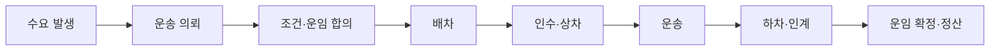

# 🚚 Freight Platform App
### 화물 운송 의뢰부터 배차·운송·정산까지

화물 운송이 필요한 사람과 운송 수행자를 연결하는 플랫폼을 구상합니다.

**누가 의뢰하고, 무엇을 운송하며, 어떻게 거래가 완료되는지**부터 정의합니다.

## 🎯 프로젝트 목적

- 의뢰자와 운송 수행자 사이의 거래 구조 이해
- 운송 접수부터 정산까지 업무 흐름 정리
- 도메인 학습을 바탕으로 데이터 구조와 서비스 설계

## 🔎 국내 서비스의 성과와 검토 과제

2026-09-14 공개 자료 조사. 대중 인지도·업계 이용 규모·수익성을 구분하며, 아래 서비스를 일괄적으로 실패 사례로 보지 않습니다.

| 서비스 | 공개 자료에서 확인한 내용 | 우리의 해석·검증 과제 |
|---|---|---|
| 카카오 T 트럭커 | 일부 앱 후기에 일감·운임·검색 조건에 대한 불만이 있음. [앱스토어](https://apps.apple.com/kr/app/id6458733099) | 지역·차종별로 충분한 일감과 적절한 운임을 제공하는지 검증해야 함. 일부 후기는 전체 이용자를 대표하지 않음 |
| CJ대한통운 더 운반 | 2026년 3월 기업 계약운송·운송 설계까지 확대. 고객이 운송 과정 전반의 개선을 원했다고 설명. [CJ 발표](https://cjnews.cj.net/?p=74431) | 단순 연결을 넘어 기업의 운영 문제를 해결해야 한다는 시사점. 사업 확대를 실패의 증거로 해석하지 않음 |
| 화물맨 | 공식 홈페이지에 연간 거래액 2조 원·차주 회원 5만 명 제시. 집계 기준연도는 미표기. [공식 소개](https://2424-2424.com/) | 기존 정보망의 규모를 고려해야 함. 거래액·회원 수는 회사 매출·이익·활성 이용자 수와 다름 |
| 센디 | 회사 발표상 2025년 매출 197억 원, 기업 고객 매출 비중 70~80%. 2026년 하반기 월간 흑자 전환 목표 제시. [센디 발표](https://sendy.ai/newsroom/센디-ai-화물운송-첫-흑자) | 반복 고객 확보와 거래별 수익성 검증이 중요. 흑자 목표의 달성 여부는 이번 조사에서 확인하지 못함 |

업체 발표는 자체 집계·설명이며, 각 자료의 기간과 지표가 달라 수치만으로 순위를 매기지 않습니다.

### 과거 철수·전환 사례에서 배울 점

아래는 [LG경영연구원의 2024년 5월 보고서](https://www.lgbr.co.kr/uploadFiles/ko/pdf/busi/LGBR_Report_240507_20244907134951728.pdf)에 정리된 당시 사례입니다. 현재 운영 상태를 뜻하지 않으며, 과거 CJ ‘헬로’와 현재 ‘더 운반’은 구분합니다.

| 사례 | 보고서가 설명한 경과 | 우리에게 주는 질문 |
|---|---|---|
| SK플래닛 트럭킹 | 물량 기준 업계 3위까지 성장했으나 추가 투자 여력 부족으로 약 1년 만에 철수 결정 | 물량 확보 이후에도 운영을 지속할 자금과 수익 구조가 있는가? |
| CJ대한통운 헬로 | 보고서 당시 자체 화물차 네트워크 관리 시스템으로 활용 | 외부 고객이 기존 거래 방식을 바꿀 만큼의 가치가 있는가? |
| 한솔로지스틱스 다이렉트넷 | 외부 운송사 협업만으로 성장하는 데 한계를 느끼고 빈 컨테이너 활용 운송 중개로 전환 | 필요한 운송 역량을 직접 확보하거나 파트너와 안정적으로 제공할 수 있는가? |

보고서는 기존 정보망의 물량·영업 네트워크, 복잡한 운송 조건, 사고·지연 대응을 주요 과제로 다룹니다. 특정 업체의 약점이나 철수 원인을 하나로 단정하기보다 고객 확보·현장 운영·수익성을 함께 검증합니다.

## 🔄 기본 업무 흐름

## 🧩 정리 중인 핵심 개념

| 구분 | 정의할 내용 |
|---|---|
| 사용자·거래처·조직 | 누가, 누구의 명의로 업무를 수행하는가 |
| 운송 서비스·화물 | 계약하는 작업과 실제 옮기는 물품 |
| 차량·기사·장비 | 운송을 수행하는 데 필요한 자원 |

## 🗓️ 진행 현황

- [x] 서비스 목적 초안 정리
- [x] 국내 유사 서비스 조사
- [x] 주요 개념과 기본 업무 흐름 초안 작성
- [x] 대표 운송 시나리오와 참여자 정의
- [x] 단계별 담당·기록 정보·완료 조건 초안 작성
- [x] 업무 기반 테이블 후보와 관계 검토 질문 정리
- [ ] 기준정보와 주문별 정보 구분
- [ ] ERD 초안 작성
- [ ] 기술 스택 및 구현 범위 검토

> 현재는 기획 단계이며, 상세 정책과 데이터 구조는 검토 중입니다.

## 🧭 업무에서 데이터 구조까지

위에서 정리한 업무 흐름과 핵심 개념을 실제 상황에 대입해, 필요한 정보와 데이터 구조를 검토합니다.

### 01 · 대표 운송 시나리오

> 회사 물류 담당자가 창고의 포장된 냉장고 3대를 매장으로 보내는 상황을 가정합니다.

아래는 실제 회사나 거래 정보를 사용하지 않은 설계 검토용 사례입니다.

| 참여자 | 이번 사례의 역할 |
|---|---|
| 의뢰 회사 물류 담당자 | 회사 명의로 운송을 요청하고 조건 확인 |
| 창고 담당자 | 보내는 사람으로서 화물 준비·상차·인계 |
| 운송사 배차 담당자 | 적합한 기사와 차량 배정 |
| 운송 기사 | 화물 인수·적재 상태 확인·운송·인계 |
| 매장 담당자 | 받는 사람으로서 하차·수량 및 상태 확인 |
| 양측 정산 담당자 | 운임 청구·수금·지급 처리 |

**운송 조건:** 지정일에 창고에서 매장까지 운송하며, 화물의 중량·치수와 현장 장비를 확인해 차량을 정합니다. 의뢰 회사가 운임을 부담하고 운송 완료 후 지급하는 것으로 가정합니다.

한 사람이 여러 역할을 맡을 수 있습니다. 보내는 사람과 받는 사람이 반드시 앱 가입자인 것은 아니며, 상하차 담당과 지급 시점은 주문의 합의 조건에 따라 달라질 수 있습니다.

### 02 · 단계별 업무 정의

대표 사례에 기본 업무 흐름을 적용합니다. **완료 조건은 다음 단계로 넘어가기 위해 확인할 기준**입니다.

#### 의뢰부터 배차까지

| 단계 | 담당 | 처리 내용 | 주요 기록 | 완료 조건 |
|---|---|---|---|---|
| 1. 수요 발생 | 물류 담당자 | 배송 필요 확인 | 화물·목적지·희망일 | 의뢰 내용 준비 |
| 2. 운송 의뢰 | 물류 담당자 | 주문·작업 조건 등록 | 수량·중량·치수·주소·연락처·일정·상하차 조건 | 필수 정보 확인 |
| 3. 조건·운임 합의 | 물류 담당자·운송사 | 가격·작업 범위 합의 | 운임·추가비 기준·작업 범위·지급 조건 | 양측 합의 |
| 4. 배차 | 배차 담당자·기사 | 차량 배정·운송 수락 | 기사·차량·상차 예정 시각 | 배정 확정 |

#### 인수부터 정산까지

| 단계 | 담당 | 처리 내용 | 주요 기록 | 완료 조건 |
|---|---|---|---|---|
| 5. 인수·상차 | 창고 담당자·기사 | 화물 확인·적재 | 수량·상태·사진·인수 시각 | 인수·적재 확인 |
| 6. 운송 | 기사 | 목적지 이동 | 출발·도착 시각·지연·이상 내역 | 목적지 도착 |
| 7. 하차·인계 | 매장 담당자·기사 | 하차·수령 확인 | 수령자·수량·상태·완료 증빙 | 인계·수령 확인 |
| 8. 운임 확정·정산 | 양측 정산 담당자 | 최종 비용 확인·청구·수금·지급 | 운임·승인 추가비·수수료·청구·지급 내역 | 필요한 수금·지급 완료 |

> 업무 8단계가 시스템 상태 8개를 뜻하지는 않습니다. 수요 발생은 앱 밖에서 시작할 수 있으며, 운송 상태와 결제·정산 상태는 별도로 정의합니다.

현재는 정상 흐름의 초안입니다. 배차 실패·취소·수량 차이·수령 거부 등 예외 상황과 상태 변경 권한은 후속 검토 대상입니다.

### 03 · 업무에서 도출한 테이블 후보

단계별로 기록해야 하는 정보를 모아 테이블 후보를 도출합니다. **업무 한 단계마다 테이블 하나를 만드는 방식은 아닙니다.** 같은 주문을 여러 단계에서 사용하고, 한 주문에 여러 기록이 연결될 수 있습니다.

| 업무에서 찾은 정보 | 테이블 후보 | 검토할 관계 |
|---|---|---|
| 누가 어떤 소속으로 의뢰하는가 | 사용자·거래 주체·조직·소속 | 사용자와 회사·조직의 소속 및 역할 |
| 무엇을 어디로 보내는가 | 운송 주문·주문 화물 | 주문 하나에 여러 화물 항목을 등록하는가 |
| 어떤 조건으로 거래하는가 | 견적·합의 조건 | 여러 견적 중 무엇을 확정하고 변경 이력을 어떻게 남기는가 |
| 누가 어떤 차량으로 수행하는가 | 기사·차량·배차 | 재배차 이력과 현재 유효한 배차를 어떻게 구분하는가 |
| 운송 결과를 어떻게 확인하는가 | 운송 이력·인수인계 증빙 | 한 주문의 여러 상태 변경·사진·수령 확인을 어떻게 연결하는가 |
| 비용을 어떻게 처리하는가 | 청구·결제·정산 | 주문별 비용과 합산 청구·분할 지급을 어떻게 연결하는가 |

#### 설계 전에 확인할 질문

- **기준정보와 주문별 정보:** 차량 제원처럼 반복 사용하는 정보와 이번 주문의 실제 화물 중량을 어떻게 구분할까?
- **관계의 개수:** 한 주문에 화물·견적·배차·증빙이 각각 하나인지, 여러 개인지?
- **역할과 권한:** 한 사용자가 의뢰와 정산을 함께 맡을 때 어떤 조회·변경 권한을 줄까?
- **현재 값과 이력:** 담당 기사나 합의 운임이 바뀌었을 때 이전 정보를 어떻게 보존할까?

> 현재 목록은 개념 수준의 후보입니다. 실제 테이블 분리·통합, 키와 관계는 아직 확정하지 않았습니다.

다음에는 이 질문을 바탕으로 기준정보와 주문별 정보를 구분하고, 관계를 정리한 뒤 ERD 초안을 작성합니다.

## 🤖 Codex 활용

OpenAI Codex를 조사 정리와 설계 대안 검토에 활용합니다.

제안된 내용을 직접 검토하며, **선택한 방향과 그 이유**를 기록합니다.
