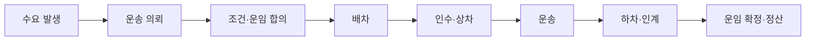

# 🚚 Freight Platform App
### 화물 운송 의뢰부터 배차·운송·정산까지

화물 운송이 필요한 사람과 운송 수행자를 연결하는 플랫폼을 구상합니다.

**누가 의뢰하고, 무엇을 운송하며, 어떻게 거래가 완료되는지**부터 정의합니다.

## 🎯 프로젝트 목적

- 의뢰자와 운송 수행자 사이의 거래 구조 이해
- 운송 접수부터 정산까지 업무 흐름 정리
- 도메인 학습을 바탕으로 데이터 구조와 서비스 설계

## 🔎 살펴본 국내 서비스

| 서비스 | 주요 학습 관점 |
|---|---|
| 카카오 T 트럭커 | 화물기사의 일감 탐색과 운송·정산 |
| CJ대한통운 더 운반 | 기업 고객의 운송 업무 관리 |
| 화물맨 | 운송사와 차주 사이의 배차·거래 |
| 센디 | 의뢰자의 운송 예약과 진행 확인 |

## 🔄 기본 업무 흐름

## 🧩 정리 중인 핵심 개념

| 구분 | 정의할 내용 |
|---|---|
| 사용자·거래처·조직 | 누가, 누구의 명의로 업무를 수행하는가 |
| 운송 서비스·화물 | 계약하는 작업과 실제 옮기는 물품 |
| 차량·기사·장비 | 운송을 수행하는 데 필요한 자원 |

## 🗓️ 진행 현황

- [x] 서비스 목적 초안 정리
- [x] 국내 유사 서비스 조사
- [x] 주요 개념과 기본 업무 흐름 초안 작성
- [x] 대표 운송 시나리오와 참여자 정의
- [ ] 기준정보와 주문별 정보 구분
- [ ] ERD 초안 작성
- [ ] 기술 스택 및 구현 범위 검토

> 현재는 기획 단계이며, 상세 정책과 데이터 구조는 검토 중입니다.

## 🧭 업무에서 데이터 구조까지

위에서 정리한 업무 흐름과 핵심 개념을 실제 상황에 대입해, 필요한 정보와 데이터 구조를 검토합니다.

### 01 · 대표 운송 시나리오

> 회사 물류 담당자가 창고의 포장된 냉장고 3대를 매장으로 보내는 상황을 가정합니다.

아래는 실제 회사나 거래 정보를 사용하지 않은 설계 검토용 사례입니다.

| 참여자 | 이번 사례의 역할 |
|---|---|
| 의뢰 회사 물류 담당자 | 회사 명의로 운송을 요청하고 조건 확인 |
| 창고 담당자 | 보내는 사람으로서 화물 준비·상차·인계 |
| 운송사 배차 담당자 | 적합한 기사와 차량 배정 |
| 운송 기사 | 화물 인수·적재 상태 확인·운송·인계 |
| 매장 담당자 | 받는 사람으로서 하차·수량 및 상태 확인 |
| 양측 정산 담당자 | 운임 청구·수금·지급 처리 |

**운송 조건:** 지정일에 창고에서 매장까지 운송하며, 화물의 중량·치수와 현장 장비를 확인해 차량을 정합니다. 의뢰 회사가 운임을 부담하고 운송 완료 후 지급하는 것으로 가정합니다.

한 사람이 여러 역할을 맡을 수 있습니다. 보내는 사람과 받는 사람이 반드시 앱 가입자인 것은 아니며, 상하차 담당과 지급 시점은 주문의 합의 조건에 따라 달라질 수 있습니다.

## 🤖 Codex 활용

OpenAI Codex를 조사 정리와 설계 대안 검토에 활용합니다.

제안된 내용을 직접 검토하며, **선택한 방향과 그 이유**를 기록합니다.
